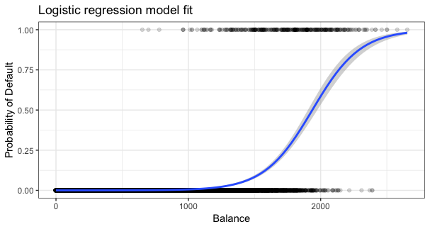
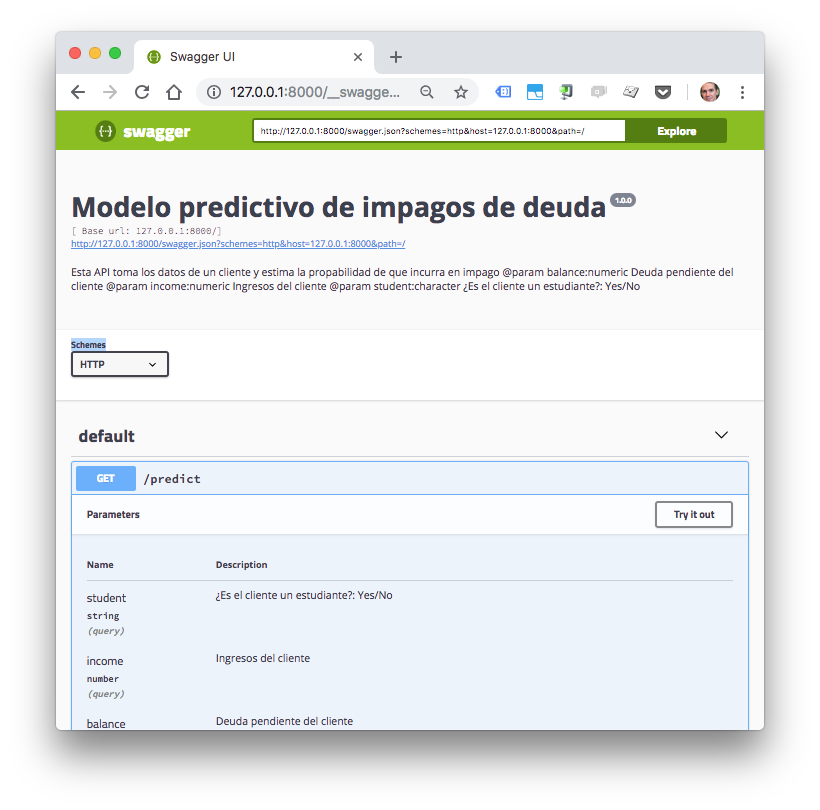
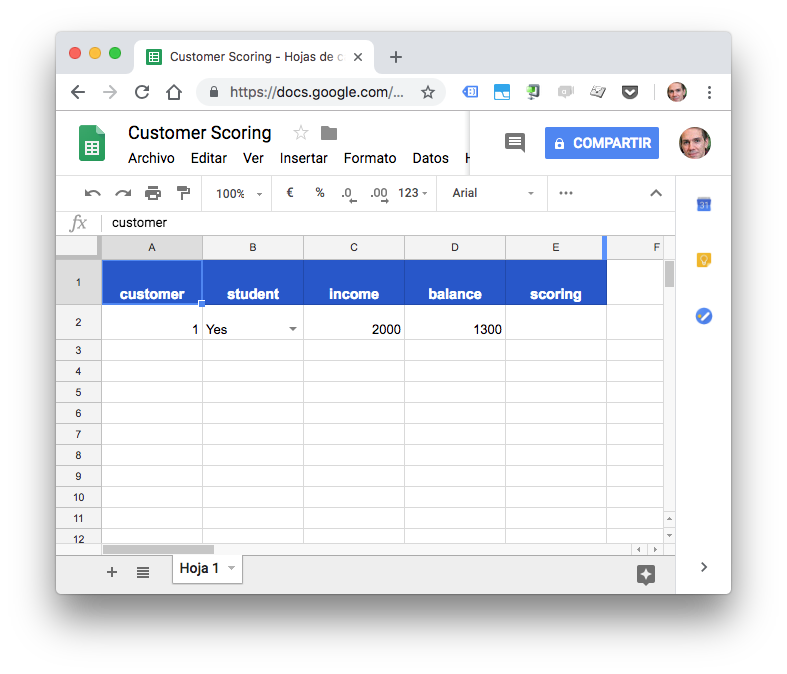

# Ciencia de datos aplicada

Material para el [Master en Big Data](https://esden.es/masters-mba/master-en-big-data-vision-omnicanal/) de Esden Business School.

### Contenidos

* Machine Learning: Modelos de aprendizaje supervisado (regresión y clasificación) y no supervisado (clustering) 
* Caso práctico completo: Sistema de scoring crediticio. Entrenamiento del modelo, publicación del mismo via Api en un contenedor docker y realización de predicciones desde una hoja de cálculo.

